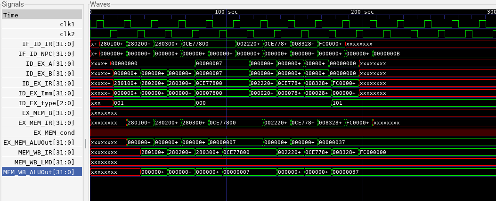
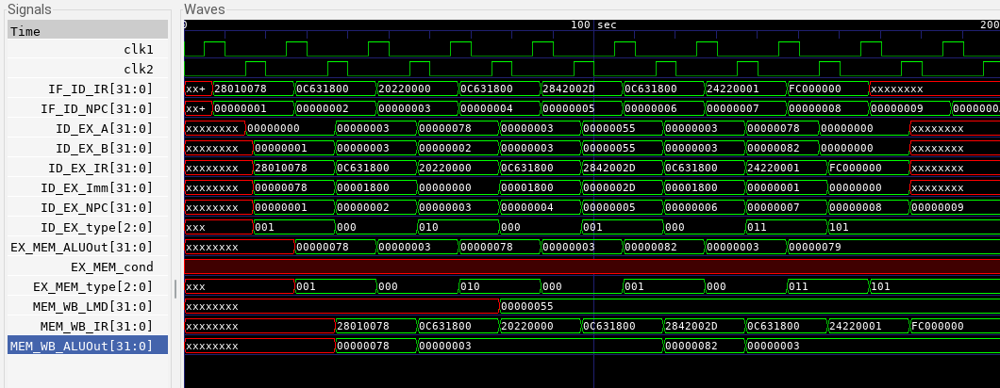

# RISC MIPS32 Microprocessor Design Using Verilog HDL

5 stage pipelined design for a simple 32-bit Reduced Instruction Set Chip (RISC) ISA microprocessor MIPS32 (Microprocessor without Interlocked Pipelined Stages). 

32 bit Program Counter, NO flag registers, very few addressing modes and assuming memory word size is 32 bits.

No steps were taken to avoid any kind of hazards in the design of the microprocessor. Instead dummy instructions were included in between the required instructions to avoid hazards during the running of programs.

# Registers

32 Registers of 32 bit each. Register 0 is always read as zero and loads to it have no effect.

# List of Instructions (Only a subset of the actual MIPS32 Instruction set have been executed)

Load and Store Instructions:

	LW  R2, 124(R8)      //R2 = Mem[R8+124]
	
	SW R5, -10(R42)      //Mem[R42-10] = R5

Arithmetic and Logic Functions on Register Operands: 

	ADD R1, R2, R3    //R1 = R2+R3

	ADD R1, R2, R0    //R1 = R2+0

	SUB R1, R2, R3    //R1 = R2-R3

	AND R1, R2, R3    //R1 = R2 & R3

	OR R1, R2, R3     //R1 = R2 | R3

	MUL R1, R2, R3    //R1 = R2*R3

	SLT R1, R2, R3    //IF R2 < R3, R1 = 1 ; else R1 = 0

	
Arithmetic and Logic Functions on Immediate Operands: 

	ADDI R1, R2, 34    //R1 = R2 + 34

	SUBI R1, R2, 42    //R1 = R2 - 42

	SLTI R1, R2, 16    // IF R2 < 16, R1 = 1; else R1 = 0

Branch Instructions:

	BEQZ R1, LOOP    //Branch to LOOP if R1 == 0

	BNEQZ R2, LOOP   //Branch to LOOP if R2 != 0

Jump Instructions have not been added.

Miscellaneous Instruction
	
	HLT    //HALT execution

# INSTRUCTION ENCODING

R- type, I-type and Jump-type (not included)

1. R-type

		
	|31-26 | 25-21 |20-16 |	15-11 |	11-0|
	| --- | --- | --- | --- | --- |
	|OPCODE| SOURCE Register 1| SOURCE Register 2| Destination Register | -empty-|                         
	
	 
	
	| Instruction | Code|
	| --- |---|
	| ADD | 000000 |  
	| SUB | 000001 |
	| AND | 000010 | 
	| OR | 000011 |
	| SLT | 000100 |
	| MUL | 000101 |
	| HLT | 111111 |
	
  	 
	
--> SUB R5, R12, R25
		
|000001|01100|11001|00101|00000000000|
|---|---|---|---|---|
|SUB|R12|R25|R5|empty|

 		
	
	
2. I-type
	
	|31-26|	25-21| 20-16| 15-0|
	|---|---|---|---|
	|OPCODE| Source Register–1| Destination Register| 16 bit immediate Data|

|Instruction|Code|
|---|---|
|LW|001000|
|SW|001001|
|ADDI|001010|
|SUBI|001011|
|SLTI|001100|
|BNEQZ|	001101|
|BEQZ|	001110|

--> LW R20, 84(R9)
	
|001000	|01001	|10100	|0000000001010100|
|---|---|---|---|
|LW	|R9	|R20	|Offset|

		
--> BEQZ R25, Label

|001110|11001|00000|YYYYYYYYYYYYYYYY|
|---|---|---|---|
|BEQZ|R25|Unused|Offset|
		
--> HERE Offset = Number of Instructions we Need to go back +1
		
# INSTRUCTION CYCLE

We divide the instruction cycle into 5 steps:
	 
   1. IF: Instruction Fetch : Here the instruction pointed to by the PC is fetched from the memory and also the next value of PC is computed.
	For the branch instruction, the new value of PC may be the target address. So PC is not updated in this stage; the new value is stored in a register NPC.
	
	
   2. ID: Instruction Decode : The instruction already fetched in IF is decoded. 
	        Decoding is done in parallel with reading the register operands rs and rt, the two source registers.
	        Similarly, the immediate data are sign extended.
		
		
   3. EX: Execution/ Effective Address Calculation : ALU is used to perform some calculation. ALU operates on the operands that have already been made ready in the 	last step.
   
   
   4. MEM: Memory Access : The only instructions that make use of this step are LOAD , STORE, and BRANCH.
	        LOAD and STORE access the memory. BRANCH updates the PC depending upon the outcome of the branch condition.
	    
	    
   5. WB: Register Write Back : The Result is written back in the register file. The result may come from ALU or memory System by load system. 

# SAMPLE PROGRAM 1

To add 10, 20 and 25 and store it in a register

	1. ADDI R1, R0, 10;     //Store 10 in R1
	2. ADDI R2, R0, 20;    //Store 20 in R2
	3. ADDI R3, R0, 25;     //Store 25 in R3
	4. OR R7, R7, R7        --dummy instructions to avoid hazards
	5. OR R7, R7, R7        --dummy 
	6. ADD R4, R1, R2     //Add R1 and R2 and store in R4
	7. OR R7, R7, R7         --dummy
	8. ADD R5, R4, R3     // Add R4 and R3 and store in R5
	9. HLT
	
# OUTPUT WAVEFORM:

# SAMPLE PROGRAM 2

To load the contents from a given memory address, add 45 to it and store it in the next memory location.
	
	1. ADDI  R1, R0, 120    //Store 120 in R1
	2. OR R3, R3, R3          //Dummy
	3. LW R2, 0(R1)           //Load R2 with Mem[R1]
	4. OR R3, R3, R3         //Dummy
	5. ADDI R2, R2, 45     //Add 45 to R2
	6. OR R3, R3, R3        //Dummy
	7. SW R2, 1(R1)         //Store the result of R2 in Mem[R1+1]
	8. HLT

# OUTPUT WAVEFORM:

